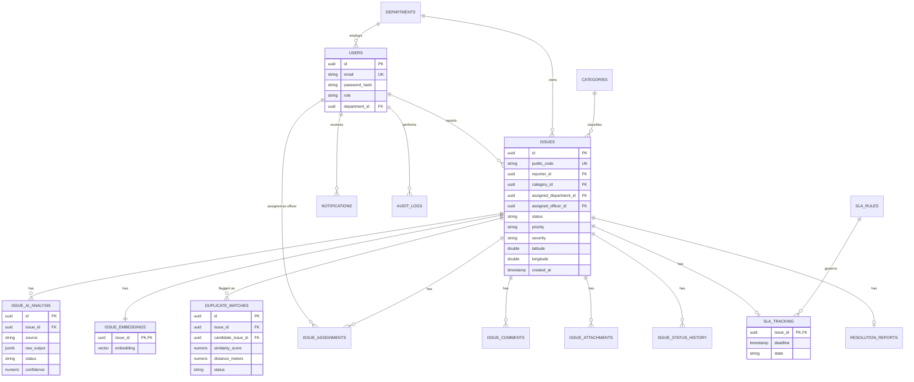
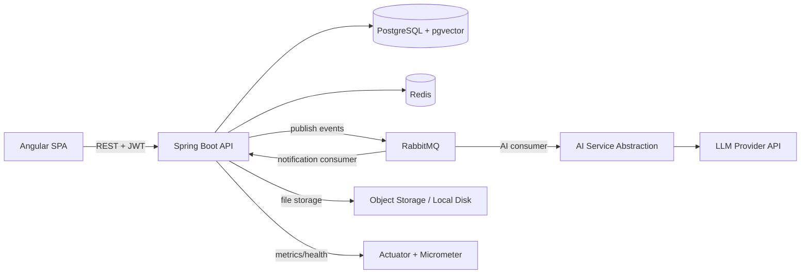
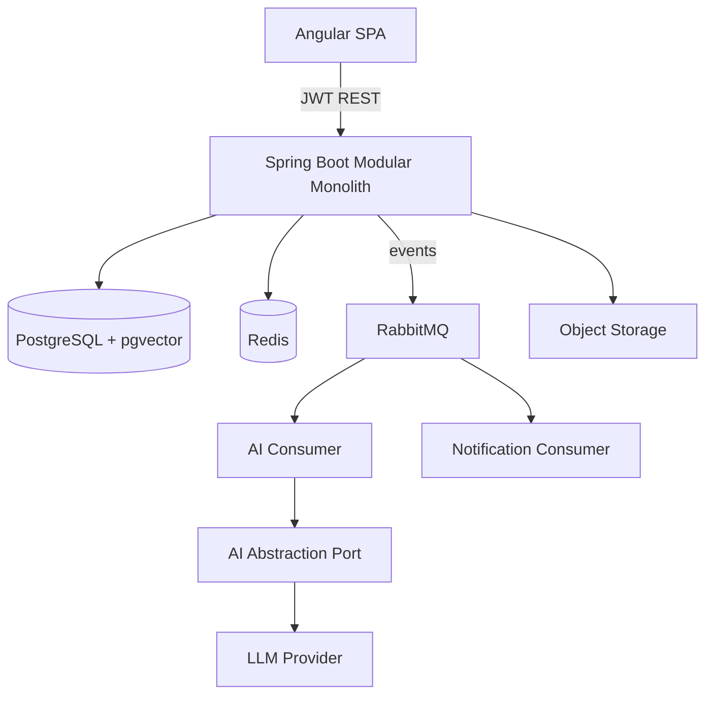

# CivicLens — Day 1 Architecture & Product Specification

**AI-Powered Civic Issue Intelligence & Resolution Platform**

---

## Section A — Product Definition

**Product description:** CivicLens lets citizens report civic/infrastructure issues (potholes, broken streetlights, garbage, drainage, leaks, electrical faults, safety hazards) with text + optional image + location. A modular-monolith Spring Boot backend uses an AI layer as a *recommendation engine* (classification, severity, duplicate detection, summarization) while deterministic business rules own all state transitions, priority, and SLA enforcement. Department managers triage and assign; field officers resolve; citizens confirm or reopen.

**Target users:** Citizen, Field Officer, Department Manager, Admin (as specified).

**Core problems solved:**
- Citizens have no structured way to report and track civic issues.
- Departments have no prioritization signal beyond manual triage.
- Duplicate reports waste field resources.
- No auditable lifecycle or SLA accountability.

**Key workflows:** Issue creation → AI triage → duplicate check → priority scoring → assignment → resolution → citizen confirmation → close. SLA monitoring. Manager analytics. Admin configuration.

**MVP scope (V1):** Everything in Sections C–N minus the "What NOT to Build" list (Section R).

**Post-MVP:** AI insights NL-analytics, email notifications, WebSocket live updates, image-based duplicate matching, advanced observability stack.

---

## Section B — Functional Requirements (Prioritized)

**P0 — Must have**
- Auth (register/login, JWT, RBAC for 4 roles)
- Issue CRUD (citizen create, all roles read per scope)
- Image upload (single image, validated, stored)
- AI text classification (category/severity/department/confidence) — async
- Business-rule validation of AI output before persistence
- Deterministic priority engine
- Status state machine + status history
- Assignment (manager → officer)
- Officer resolution flow (notes, evidence, mark resolved)
- Citizen confirm/reopen
- Duplicate detection via text embeddings + geo distance (manager confirms/rejects)
- SLA rules (configurable), SLA status computed by scheduled job
- In-app notifications
- Audit log for all state-changing actions
- Comments on issues
- Admin: manage users, departments, categories, SLA config
- Manager: department dashboard, issue queue, SLA monitoring, duplicate review
- Backend authorization on every endpoint (not just Angular guards)
- Dockerized dev environment, CI pipeline (build + test)

**P1 — Valuable**
- AI image analysis (severity/type from photo)
- AI-generated issue summarization for admins/managers
- Analytics dashboards (counts by category/department/status)
- Rate limiting on AI-triggering and auth endpoints
- Refresh token flow
- OpenAPI/Swagger docs
- Basic observability (Actuator + structured logs + correlation IDs)

**P2 — Optional**
- AI natural-language analytics ("insights") with controlled query mapping
- Email notifications
- WebSocket/SSE real-time notification push
- Image-based duplicate similarity (CLIP-style embeddings)

**OUT — Not in V1**
- Microservices split
- Multi-tenant / multi-city support
- Mobile app
- Public open-data API
- Payment/billing features
- Multi-language i18n

---

## Section C — Domain Model

**Core entities**

- **User**: id, email, passwordHash, fullName, phone, role (enum: CITIZEN, FIELD_OFFICER, DEPARTMENT_MANAGER, ADMIN), departmentId (nullable, for officers/managers), status (ACTIVE/DISABLED), createdAt.
- **Department**: id, name, code, description.
- **Category**: id, name, code, defaultDepartmentId, parentCategoryId (nullable, for subcategory).
- **Issue**: id, publicCode (e.g. CIV-1048), title, description, categoryId, subcategoryId, latitude, longitude, address, status (enum), priority (enum), severity (enum, AI-suggested but backend-confirmed), reporterId, assignedDepartmentId, assignedOfficerId, createdAt, updatedAt, resolvedAt, closedAt.
- **IssueAiAnalysis**: id, issueId, source (TEXT/IMAGE), rawModelOutput (jsonb), suggestedCategory, suggestedSeverity, suggestedDepartment, confidence, modelVersion, status (PENDING/APPLIED/REJECTED/FAILED), createdAt.
- **IssueEmbedding**: issueId, embeddingVector (pgvector), textHash, createdAt.
- **DuplicateMatch**: id, issueId, candidateIssueId, similarityScore, distanceMeters, status (SUGGESTED/CONFIRMED/REJECTED), reviewedById, reviewedAt.
- **IssueAssignment**: id, issueId, officerId, assignedById, assignedAt, acceptedAt, unassignedAt (nullable).
- **IssueComment**: id, issueId, authorId, body, createdAt.
- **IssueAttachment**: id, issueId, uploadedById, fileUrl, fileType, sizeBytes, createdAt.
- **IssueStatusHistory**: id, issueId, fromStatus, toStatus, changedById, reason, createdAt.
- **SlaRule**: id, priority (enum), durationHours, createdAt, updatedAt.
- **SlaTracking**: issueId, deadline, state (enum: WITHIN_SLA/APPROACHING/BREACHED/RESOLVED_WITHIN_SLA/RESOLVED_AFTER_BREACH), lastEvaluatedAt.
- **Notification**: id, userId, type, payload (jsonb), read (bool), createdAt.
- **AuditLog**: id, actorId, action, entityType, entityId, oldValue, newValue, timestamp, ipAddress.
- **ResolutionReport**: id, issueId, officerId, notes, resolutionSummary (AI-generated, backend-stored), submittedAt.

**Enums**
- IssueStatus: SUBMITTED, AI_ANALYZING, TRIAGED, ASSIGNED, IN_PROGRESS, RESOLVED, CLOSED, REOPENED, REJECTED, DUPLICATE, CANCELLED
- Priority: CRITICAL, HIGH, MEDIUM, LOW
- Severity: LOW, MEDIUM, HIGH, CRITICAL
- Role: CITIZEN, FIELD_OFFICER, DEPARTMENT_MANAGER, ADMIN

**Business rules (representative)**
- Only the reporter, assigned officer, department manager, or admin can view a given issue's full detail (IDOR protection).
- An issue cannot be ASSIGNED without a TRIAGED priority set.
- Only DEPARTMENT_MANAGER of the assigned department can assign officers within that department.
- CLOSED issues can only move to REOPENED by the original reporter, and only within a configurable reopen window (e.g. 14 days).
- Every status transition writes exactly one IssueStatusHistory row and (where applicable) one AuditLog row.

---

## Section D — Database Design



**Indexes/constraints:**
- `issues(status)`, `issues(assigned_department_id, status)`, `issues(reporter_id)` — composite indexes for common queries.
- Geo index (or bounding-box query) on `(latitude, longitude)` for duplicate proximity search; PostGIS not required at this scale — simple Haversine filter over a pre-filtered radius box is sufficient.
- `issue_embeddings.embedding` — ivfflat index (pgvector) for cosine similarity search.
- Unique constraint on `issues.public_code`.
- FK cascade: deleting a User is disallowed (soft-disable only) to preserve audit integrity; Issue children (comments, attachments, status history) cascade-delete only if the parent Issue is hard-deleted (which should never happen in production — issues are archived, not deleted).
- Transaction boundaries: issue creation + initial status history row is one transaction; AI analysis persistence is a separate transaction triggered by the async consumer, not by the initial request.

---

## Section E — Architecture



- **Angular ↔ Spring Boot:** REST over HTTPS, JWT bearer auth, interceptor-attached.
- **Spring Boot ↔ PostgreSQL:** JPA/Hibernate, connection-pooled (HikariCP).
- **Spring Boot ↔ Redis:** cache-aside for dashboard aggregates and reference data; rate-limit counters.
- **Spring Boot ↔ RabbitMQ:** publishes `IssueCreated`, `AIAnalysisCompleted`, `DuplicateSuggested`, `SlaBreached` events; consumers handle AI calls and notification fan-out asynchronously so the citizen's create-issue request returns immediately.
- **AI Service Abstraction:** a Java interface (`AiClassificationPort`, `AiEmbeddingPort`, `AiSummarizationPort`) implemented by a provider-specific adapter, so swapping providers doesn't touch business logic.
- **Object storage:** local disk volume in dev, S3-compatible bucket in prod, abstracted behind a `FileStoragePort`.

---

## Section F — Backend Architecture

**Package structure (modular monolith, package-by-feature):**
```
com.civiclens
 ├── common/          (exceptions, error model, base entities, auditing)
 ├── security/         (JWT filter, SecurityConfig, RBAC annotations)
 ├── user/              (User, Department, Role — entity/service/repo/controller)
 ├── issue/             (Issue aggregate: entity, state machine, repo, service, controller, DTOs)
 ├── ai/                (AiClassificationPort + adapter, embedding, summarization)
 ├── duplicate/         (DuplicateMatch domain, similarity scoring)
 ├── priority/          (PriorityEngine — pure deterministic logic)
 ├── sla/               (SlaRule, SlaTracking, scheduled evaluator)
 ├── notification/      (Notification domain, dispatch)
 ├── audit/             (AuditLog domain, aspect-based capture)
 ├── messaging/         (RabbitMQ config, producers, consumers)
 └── config/            (app-wide config, OpenAPI, CORS)
```

- **Layering:** Controller → Service → Repository, DTOs at controller boundary only (never expose entities). MapStruct or manual mappers.
- **Exception strategy:** `@ControllerAdvice` global handler mapping domain exceptions (`InvalidStateTransitionException`, `IssueNotFoundException`, `UnauthorizedActionException`) to the standardized error model (Section 26).
- **Security:** method-level `@PreAuthorize` on service methods in addition to URL-level `SecurityFilterChain` rules — defense in depth.
- **Transactions:** `@Transactional` at service layer per use case; async AI/notification work happens outside the original HTTP transaction, triggered via RabbitMQ after commit (`TransactionalEventListener(phase = AFTER_COMMIT)` publishing to the broker).
- **Async processing:** `@RabbitListener` consumers for AI analysis and notification dispatch; idempotency via a `processed_message_id` table keyed on message UUID.

---

## Section G — Angular Architecture

```
src/app/
 ├── core/            (auth service, http interceptor, error interceptor, guards)
 ├── shared/          (reusable UI components, pipes, models)
 ├── layouts/          (role-based shell layouts)
 └── features/
      ├── auth/
      ├── issues/       (create, list, detail — shared across roles, permission-gated views)
      ├── dashboard/
      ├── notifications/
      ├── administration/
      └── analytics/
```

- **Routing:** lazy-loaded feature modules/standalone routes per feature; role-based route guards (`RoleGuard`) checked against the JWT claims cached in `AuthService`.
- **Interceptors:** one for attaching the JWT, one for centralized error mapping (maps standardized backend error codes to UI toasts).
- **State management:** no NgRx — RxJS `BehaviorSubject`-backed services for auth/session state, Angular Signals for local component/UI state. The domain is not complex enough to justify NgRx overhead; issue lists are server-driven, not client-cached graphs.
- **Forms:** Reactive Forms with typed form groups and backend-mirrored validation messages.
- **Shared components:** status badge, priority badge, SLA countdown, file uploader, comment thread, status-history timeline.

---

## Section H — API Specification (representative catalogue)

| Method | Path | Auth | Roles | Notes |
|---|---|---|---|---|
| POST | /api/v1/auth/register | none | — | Citizen self-registration only |
| POST | /api/v1/auth/login | none | — | Returns access + refresh token |
| POST | /api/v1/auth/refresh | refresh token | — | Rotates refresh token |
| POST | /api/v1/issues | JWT | CITIZEN | multipart (text + optional image); returns 201 with issue in SUBMITTED state |
| GET | /api/v1/issues | JWT | all (scoped) | Citizen sees own; officer sees assigned; manager sees department; admin sees all. Filters: status, category, priority, dept; paginated |
| GET | /api/v1/issues/{id} | JWT | scoped, ownership-checked | 404 if not visible to caller (never 403 — avoids leaking existence) |
| PUT | /api/v1/issues/{id} | JWT | reporter (pre-triage only) | Edit description/category before AI_ANALYZING completes |
| POST | /api/v1/issues/{id}/comments | JWT | scoped | |
| POST | /api/v1/issues/{id}/assign | JWT | DEPARTMENT_MANAGER | body: officerId; validates same department |
| POST | /api/v1/issues/{id}/status | JWT | role-per-transition (Section 5 matrix) | body: targetStatus, reason |
| POST | /api/v1/issues/{id}/resolve | JWT | FIELD_OFFICER (assigned only) | body: notes, evidence attachment ids |
| POST | /api/v1/issues/{id}/confirm | JWT | CITIZEN (reporter only) | closes RESOLVED → CLOSED |
| POST | /api/v1/issues/{id}/reopen | JWT | CITIZEN (reporter only) | within reopen window |
| GET | /api/v1/issues/{id}/duplicates | JWT | DEPARTMENT_MANAGER | AI-suggested candidates |
| POST | /api/v1/duplicates/{id}/confirm\|reject | JWT | DEPARTMENT_MANAGER | |
| GET | /api/v1/notifications | JWT | all | paginated, unread-first |
| GET | /api/v1/dashboard | JWT | role-specific aggregate | Redis-cached, short TTL |
| GET | /api/v1/admin/audit-logs | JWT | ADMIN | filterable |
| PUT | /api/v1/admin/sla-rules | JWT | ADMIN | |

Every endpoint returns the standardized error model on failure (Section 26) and enforces both URL-level role checks and method-level ownership checks.

---

## Section I — AI Architecture

**Model responsibilities:** classification (category/severity/department/confidence), image analysis (detected issue/severity/confidence), text embeddings (duplicate detection), summarization (admin-facing narrative), optionally NL-analytics (P2).

**Structured output + validation pipeline:**
```
Raw issue text/image
  → Prompt with strict JSON schema instruction
  → LLM response
  → JSON schema validation (reject malformed)
  → Business validation (category exists? department exists? confidence ≥ threshold?)
  → If valid: store as IssueAiAnalysis(status=APPLIED), feed PriorityEngine
  → If invalid/low-confidence: status=PENDING/FAILED, fall back to manual manager triage
```

**Confidence handling:** if `confidence < 0.6`, the AI suggestion is stored but not auto-applied — issue goes straight to manager triage queue instead of auto-routing.

**Embeddings/duplicate detection:** text embedding stored in `pgvector`; candidate search = cosine similarity above threshold (e.g. 0.85) **AND** within a geo radius (e.g. 150m) **AND** same/related category. Score is a weighted combination, never a single model output. Manager confirms or rejects — never auto-merged.

**Summarization:** generated once at RESOLVED transition, from description + comments + status history + resolution notes; stored on `ResolutionReport.resolutionSummary`; never regenerated automatically (cost control), only on manager-triggered "regenerate" action.

**Prompt injection protection:** issue text/comments are always sent as data within a fenced, clearly-delimited user-content block, never concatenated into instructions; the system prompt explicitly instructs the model to treat all citizen-supplied content as untrusted data, not instructions; output is constrained to the JSON schema and any non-conforming output is discarded, so even a successful injection cannot escape into executable business logic — it can only corrupt its own recommendation, which is still gated by validation.

**Failure handling:** timeouts/rate limits/provider outages → message stays in RabbitMQ retry queue with exponential backoff (3 attempts) → dead-letter queue → issue falls back to `TRIAGED` state with `AI_UNAVAILABLE` flag for manual manager classification. The citizen-facing flow never blocks on AI.

**Cost control:** classification only runs once per issue (not per edit); embeddings computed once; summarization only at resolution or on-demand; response token limits capped; NL-analytics (P2) restricted to a fixed allow-listed set of query templates rather than open-ended SQL generation.

---

## Section J — Messaging Architecture

- **Exchange:** single topic exchange `civiclens.events`.
- **Routing keys:** `issue.created`, `issue.ai.completed`, `issue.duplicate.suggested`, `issue.status.changed`, `sla.breached`.
- **Queues:** `ai-analysis.queue` (bound to `issue.created`), `notification.queue` (bound to `issue.*`, `sla.breached`), each with a matching `*.retry` queue (TTL + dead-letter exchange back to the original queue) and a `*.dlq` after max retries.
- **Retry strategy:** 3 attempts with exponential backoff via per-message TTL retry queues; after exhaustion, message lands in DLQ and raises an operational alert (log-level ERROR + metric increment).
- **Idempotency:** every message carries a UUID; consumers check a `processed_messages(message_id)` table (unique constraint) before acting, so redelivery after a consumer crash is a no-op.
- **Why RabbitMQ (not synchronous AI calls):** LLM calls take 1–5+ seconds and can fail/timeout; doing this inline would block the citizen's create-issue request and couple API latency to a third-party SLA. Async decoupling keeps the write path fast and makes AI failures non-fatal to the core product.

---

## Section K — Redis Strategy

| Cached item | Key | TTL | Invalidation |
|---|---|---|---|
| Dashboard aggregates (per role/department) | `dash:{role}:{deptId}` | 60s | time-based only (acceptable staleness) |
| Category/department reference lists | `ref:categories`, `ref:departments` | 1h | explicit evict on admin write |
| Rate-limit counters (login attempts, AI-triggering endpoints) | `rl:{userId}:{endpoint}` | sliding window | expires naturally |
| In-flight AI processing state (optional) | `ai:processing:{issueId}` | 5 min | cleared on completion |

Redis is **not** used as a system of record for anything — pure cache-aside with short TTLs, so a Redis outage degrades performance, not correctness.

---

## Section L — Security Model

**Auth flow:** login → password verified (BCrypt) → short-lived JWT access token (15 min) + longer-lived refresh token (7 days, stored hashed, rotated on use, revocable). Angular stores access token in memory, refresh token in an HttpOnly cookie.

**RBAC matrix (representative):**

| Action | Citizen | Officer | Manager | Admin |
|---|---|---|---|---|
| Create issue | ✅ | ❌ | ❌ | ❌ |
| View own issue | ✅ | — | — | — |
| View assigned issue | — | ✅ | ✅ (dept) | ✅ |
| Assign officer | ❌ | ❌ | ✅ (own dept) | ✅ |
| Change status (officer transitions) | ❌ | ✅ (assigned only) | ✅ | ✅ |
| Confirm/reopen | ✅ (own) | ❌ | ❌ | ❌ |
| Manage users/SLA/categories | ❌ | ❌ | ❌ | ✅ |

**Key risks & mitigations:**
- **IDOR:** every read/write re-checks ownership/department scope server-side, not just role.
- **Privilege escalation:** role changes are admin-only, audited, and never settable via self-service profile update.
- **File upload:** content-type + magic-byte validation, size limits, stored outside the webroot, served via signed URLs — no executable extensions accepted.
- **CORS:** explicit allow-list of the Angular origin only.
- **CSRF:** mitigated by JWT-in-header (not cookie) for access tokens; refresh cookie is `HttpOnly`, `SameSite=Strict`.
- **Token theft:** short access-token TTL + refresh rotation + revocation list in Redis.
- **Rate limiting:** login and AI-triggering endpoints rate-limited per user/IP via Redis counters.

---

## Section M — Testing Strategy

**Backend:** unit tests for PriorityEngine and state-machine transition rules (highest value — pure business logic); service-layer tests with mocked repos/AI port; controller tests (MockMvc) for auth/role enforcement per endpoint; integration tests (Testcontainers: Postgres + RabbitMQ) for the full create→AI→triage flow; security tests specifically targeting IDOR (user A cannot fetch user B's issue).

**Frontend:** component tests for the issue-creation form and status-transition UI; service tests for the HTTP interceptor's token-refresh logic; one critical workflow test (create issue → see it in "My Issues").

**E2E (minimum):** the full lifecycle — citizen creates issue → AI analysis completes → manager assigns → officer resolves → citizen confirms → issue closed.

**Priority order:** state-machine/business-rule unit tests > authorization/security tests > async/integration tests > controller tests > E2E > pure UI component tests.

---

## Section N — Deployment Architecture

- **Dev:** `docker-compose.yml` with Postgres+pgvector, Redis, RabbitMQ, backend, frontend — one command up.
- **CI (GitHub Actions):** on PR — backend build+test, frontend build+test, lint; on merge to main — build Docker images, push to registry.
- **Production target:** a single cloud VM or small managed-container service (e.g. Render/Fly.io/AWS ECS) running the Docker images, managed Postgres (with pgvector extension enabled), managed Redis, managed RabbitMQ (or CloudAMQP free tier) — deliberately avoiding Kubernetes at this scale.
- **Secrets:** all via environment variables injected at deploy time (DB creds, JWT secret, AI API key, Redis/RabbitMQ URLs) — never committed, `.env` gitignored, `.env.example` committed.

---

## Section O — Development Roadmap (22 working days)

| Day | Objective | Deliverable | DoD |
|---|---|---|---|
| 1 | Project scaffolding | Spring Boot + Angular skeletons, Docker Compose, CI skeleton | `docker compose up` runs both apps |
| 2 | User/Auth domain | User entity, register/login, JWT issuing | Login returns valid JWT; unit tests pass |
| 3 | Spring Security + RBAC | SecurityFilterChain, role annotations, Angular guards/interceptor | Protected endpoint returns 401/403 correctly |
| 4 | Department/Category domain | Entities + admin CRUD endpoints | Admin can CRUD departments/categories |
| 5 | Issue domain core | Issue entity, create endpoint, DTOs | Citizen can create an issue (no AI yet) |
| 6 | Status state machine | Transition matrix enforced, IssueStatusHistory | Invalid transitions rejected with correct error |
| 7 | File upload | Attachment entity, storage port, validation | Image uploads on issue creation |
| 8 | RabbitMQ setup | Exchange/queues/DLQ, IssueCreated event | Message observably flows end-to-end (logged) |
| 9 | AI abstraction + classification | AiClassificationPort, provider adapter, schema validation | Classification result persisted, validated |
| 10 | Priority engine | Deterministic scoring, unit tests | 100% branch-covered priority tests pass |
| 11 | SLA rules + tracking | SlaRule config, SlaTracking creation on triage | SLA deadline correctly computed |
| 12 | Scheduled SLA evaluator | Spring `@Scheduled` job, state transitions | Approaching/breached states update correctly |
| 13 | Assignment flow | Manager assign, IssueAssignment, dept scoping | Manager can only assign within own dept |
| 14 | Officer resolution flow | Resolve endpoint, ResolutionReport | Officer resolves, citizen notified |
| 15 | Citizen confirm/reopen | Confirm/reopen endpoints + window rule | Reopen only within window, by reporter |
| 16 | Embeddings + pgvector | Embedding generation on create, pgvector index | Embeddings stored, similarity query works |
| 17 | Duplicate detection | Candidate search, DuplicateMatch, manager review UI hooks | Suggested duplicates appear with score+distance |
| 18 | Notifications | Notification entity, consumer, in-app list endpoint | Notifications generated on key events |
| 19 | Audit logging | Aspect-based capture on state changes | Every transition produces an audit row |
| 20 | Angular: citizen + officer screens | Create/My Issues/Detail, Officer dashboard | Full citizen+officer flow usable in UI |
| 21 | Angular: manager + admin screens | Queue, assignment, SLA monitor, duplicate review, admin config | Manager/admin flows usable in UI |
| 22 | Hardening + docs | Error handling polish, OpenAPI docs, README, final test pass | All P0 tests green, `docker compose up` demoable end-to-end |

(Buffer of 2–5 days recommended for AI image analysis (P1), summarization (P1), and polish, bringing total to 24–27 days.)

---

## Section P — Technical Risks (top 15)

| # | Risk | Prob. | Impact | Mitigation |
|---|---|---|---|---|
| 1 | AI provider outage blocks triage | Med | Med | Async queue + fallback to manual triage |
| 2 | Prompt injection via issue text | Med | Med | Data/instruction separation, schema validation |
| 3 | IDOR exposing other users' issues | Med | High | Server-side ownership checks on every read |
| 4 | Duplicate detection false positives annoy managers | Med | Low | Manager confirm/reject, tunable thresholds |
| 5 | pgvector performance at scale | Low | Med | ivfflat index, radius pre-filter before vector search |
| 6 | RabbitMQ message loss on crash | Low | Med | Durable queues, publisher confirms, idempotent consumers |
| 7 | JWT theft via XSS | Med | High | In-memory token storage, CSP headers, HttpOnly refresh cookie |
| 8 | File upload used to store malicious files | Low | Med | Magic-byte validation, non-executable storage path |
| 9 | Scope creep beyond 22–27 days | High | Med | Strict P0/P1/P2 discipline, Section R exclusions |
| 10 | SLA scheduled job drifting/double-firing | Low | Low | Idempotent evaluation keyed on issue state, not counters |
| 11 | Underestimating state-machine edge cases | Med | Med | Exhaustive transition matrix + unit tests written early (Day 6) |
| 12 | AI cost overrun from repeated calls | Low | Low | Classify/embed once, summarize only on resolve |
| 13 | Redis treated as source of truth by mistake | Low | Med | Explicit cache-aside pattern, DB always authoritative |
| 14 | Angular role guard mistaken for real security | Med | High | Documented rule: guards are UX only, backend enforces |
| 15 | Testcontainers slow CI feedback loop | Med | Low | Split fast unit-test job from slower integration-test job |

---

## Section Q — Architecture Decisions (ADRs)

**ADR-1: PostgreSQL over MongoDB**
Context: relational data (users, issues, assignments, SLA) with strong consistency needs and need for pgvector.
Options: PostgreSQL, MongoDB.
Chosen: PostgreSQL.
Reason: issue lifecycle has strict relational integrity requirements (FKs, transactions across assignment/status/audit); pgvector gives embeddings in the same store, avoiding a second database.
Tradeoff: less schema flexibility than MongoDB, acceptable since the domain is well-defined upfront.

**ADR-2: pgvector over dedicated vector DB**
Context: need similarity search for ~100k issues.
Options: pgvector, Pinecone, Qdrant, Weaviate.
Chosen: pgvector.
Reason: at this scale (100k rows) pgvector's ivfflat index is more than sufficient; avoids operating a second stateful service.
Tradeoff: would need to migrate to a dedicated vector DB well beyond this scale (millions of vectors, sub-10ms latency SLAs).

**ADR-3: RabbitMQ for AI/notification processing**
Context: AI calls are slow/unreliable; must not block citizen requests.
Options: synchronous call, RabbitMQ, Kafka.
Chosen: RabbitMQ.
Reason: simple topic-exchange semantics fit the event fan-out (AI + notifications) well; Kafka's log-based model is unnecessary complexity for this event volume.
Tradeoff: at very high throughput, Kafka's partitioned log would scale better — not a concern at target scale.

**ADR-4: Modular monolith over microservices**
Context: single small team, tight timeline.
Options: monolith, microservices.
Chosen: modular monolith with clear package boundaries.
Reason: avoids distributed-systems overhead (service discovery, distributed tracing, network failure modes) while still demonstrating clean domain boundaries; a future split (e.g. extracting the AI module) is straightforward because it's already isolated behind a port/interface.
Tradeoff: single deployable scales as one unit; acceptable at target scale (hundreds of concurrent users).

**ADR-5: AI as recommendation layer, never final authority**
Context: AI outputs must not corrupt operational state.
Chosen: AI → schema validation → business validation → deterministic PriorityEngine/state machine.
Reason: hallucinated categories, invalid departments, or low-confidence output must never silently become ground truth.
Tradeoff: adds a validation layer of code, but this is the core interview-defensible design choice of the whole project.

**ADR-6: No NgRx**
Context: state is mostly server-driven, not a complex client-side graph.
Chosen: RxJS services + Signals.
Reason: NgRx's boilerplate (actions/reducers/effects) isn't justified by this domain's client-state complexity.
Tradeoff: would reconsider if the app grew significant cross-cutting client state (e.g. offline-first sync).

---

## Section R — What NOT to Build (V1 exclusions)

- **Microservices** — adds deployment/network complexity with zero product benefit at this scale.
- **Multi-tenant/multi-city support** — real product feature, but not needed to demonstrate the target skills, and multiplies schema/auth complexity.
- **Open-ended NL-to-SQL analytics** — genuine prompt-injection/SQL-injection risk surface for a "nice to have" feature; ship only the constrained, allow-listed version (P2) if time remains.
- **Image-based duplicate matching (CLIP embeddings)** — interesting but marginal value over text+geo duplicate detection already in V1; expensive to get right.
- **Kafka** — no throughput justification over RabbitMQ at this scale.
- **Kubernetes** — massive ops overhead for a portfolio project; Docker Compose + a single managed container host is the right level.
- **Full observability stack (Prometheus+Grafana) in V1** — Actuator + structured logs is enough to be credible; add Prometheus/Grafana only as a V2/V3 stretch.
- **Mobile app** — out of scope entirely; not part of the resume objective.

---

# Critical Review Pass (Skeptical Staff Engineer)

**Overengineering risks found:**
- IssueEmbedding as its own table is fine, but do not build a generic "vector search framework" — one query, one index, ship it.
- Resist the temptation to add a generic rules-engine DSL for the PriorityEngine — a straightforward weighted-scoring Java class with unit tests is more defensible in an interview than a half-built rules engine.
- AI Insights (NL analytics) is the single highest-risk P2 feature — if time is tight, cut it entirely rather than shipping a half-safe version. A half-safe NL-to-query feature is worse for security-interview credibility than not having it.

**Security gaps to double check during implementation:**
- Make sure the 404-not-403 pattern on `/issues/{id}` is applied consistently — currently only called out for GET; apply it to comments/attachments sub-resources too.
- File upload: confirm the storage abstraction never trusts the client-supplied filename for path construction (path traversal).
- Refresh token rotation must actually invalidate the previous token, not just issue a new one alongside it.

**Database design check:**
- `issue_status_history` and `audit_logs` will be the fastest-growing tables — confirm they're append-only with no update/delete paths, and index by `(issue_id, created_at)`.
- Confirm `public_code` generation (e.g. `CIV-xxxx`) is done via a DB sequence, not `COUNT(*)+1`, to avoid race conditions under concurrent creation.

**Scope check against 22–27 days:** the roadmap in Section O is realistic *only* if AI image analysis and NL-analytics are treated as true stretch goals cut first under time pressure — flagged accordingly in Section B (P1/P2) and Section R.

**Verdict:** architecture holds up. No microservice split needed, no unjustified technology. Main discipline required is scope control on the AI-adjacent P2 features, which are exactly the ones most likely to look impressive but eat disproportionate time.

---

# Final Output

### Recommended V1
All P0 items in Section B: full issue lifecycle, RBAC, JWT auth, async AI classification with validation, deterministic priority engine, SLA tracking, text+geo duplicate detection with manager review, in-app notifications, audit logging, Docker Compose dev environment, CI build+test.

### Recommended V2
AI image analysis, AI summarization at resolution, analytics dashboards, refresh-token hardening, OpenAPI docs, basic observability (Actuator/Micrometer + correlation IDs), rate limiting.

### Recommended V3 (production-grade)
Constrained NL-analytics, email notifications, WebSocket/SSE live updates, image-based duplicate similarity, Prometheus/Grafana, horizontal scaling of the AI consumer, extraction of the AI module into a standalone service if load justifies it.

### Final technology stack
Angular + TypeScript + Angular Material + RxJS/Signals · Java + Spring Boot + Spring Security + Spring Data JPA + Bean Validation · PostgreSQL + pgvector · RabbitMQ · Redis · LLM provider behind an abstraction port · Docker + Docker Compose · GitHub Actions · OpenAPI/Swagger.

### Final architecture (one diagram)


### Top 10 engineering concepts you will learn (ranked)
1. Designing a deterministic state machine around an untrusted AI recommendation layer
2. Backend-enforced authorization vs. frontend guards (real IDOR prevention)
3. Async event-driven processing with RabbitMQ (retry/DLQ/idempotency)
4. Embeddings + pgvector similarity search integrated into a relational schema
5. JWT auth with refresh rotation and revocation
6. Modular monolith package-by-feature design with clean seams for future extraction
7. Structured-output validation pipelines for LLM integration
8. Cache-aside strategy with Redis without compromising consistency
9. Scheduled-job design for SLA evaluation at scale
10. Audit-log/event-sourcing-adjacent design for compliance-grade traceability

### Top 20 interview questions (based on this architecture)
1. Why does the AI never directly set an issue's final priority or status?
2. Walk me through what happens if the AI returns a hallucinated category.
3. How do you prevent prompt injection from citizen-submitted text?
4. Why RabbitMQ instead of calling the AI provider synchronously?
5. How do you guarantee a message isn't processed twice after a consumer crash?
6. Why pgvector instead of a dedicated vector database at this scale?
7. How would duplicate detection scale to 10x the issue volume?
8. Explain the full JWT + refresh token flow and how you prevent token theft.
9. How do you prevent IDOR on `GET /issues/{id}`? Why 404 instead of 403?
10. Why is Angular's route guard not sufficient for security?
11. Walk through your issue status state machine — why disallow arbitrary transitions?
12. How is SLA breach detection implemented, and why a scheduled job rather than real-time?
13. What's cached in Redis, and what would break if Redis went down?
14. Why a modular monolith instead of microservices for this project?
15. How would you extract the AI module into its own service later, and what would change?
16. How do you keep AI costs bounded as issue volume grows?
17. What's your dead-letter-queue strategy, and how do you get alerted on it?
18. How do you validate uploaded files against malicious content?
19. Describe your audit log design — what guarantees does it give you?
20. If the LLM provider had an outage for an hour, what would a citizen and a manager each experience?
